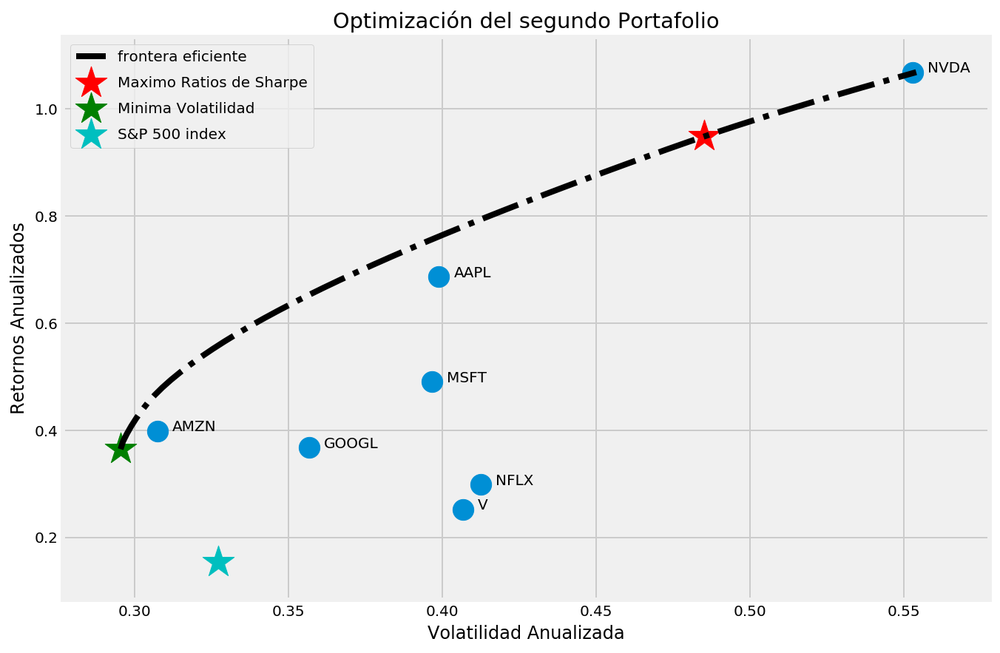
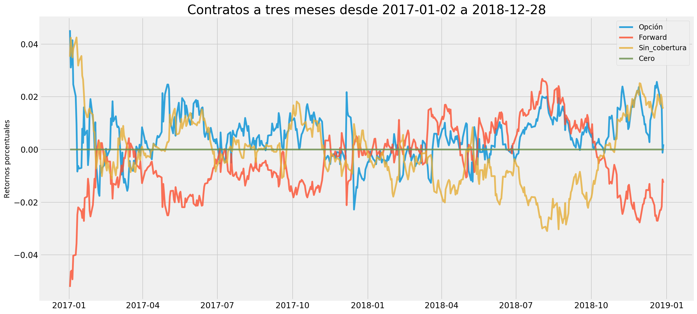

# Finance with Python

This file contains the following two notebooks:

- Markowitz_portafolio: Which uses markowitz portfolio Optimization and apply to a set of 7 stocks.
- Fwd_opciones_y_spot: Which **backtest a FX hedging strategy** with Vanilla Options & Forward. Then we applied an optimizer in order to see if an optimized portfolio made of vanilla strategies or spot could perform better on the backtest.

